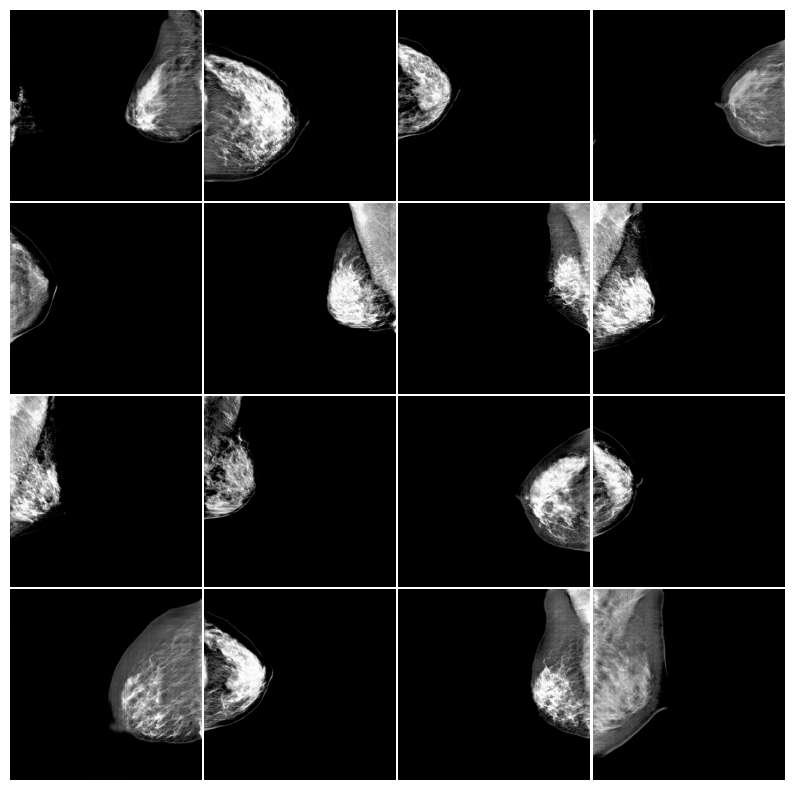

<h1>Training ProGAN on VinDr-Mammo</h1>

<h2>Overview</h2>
This project focuses on training a Progressive Growing GAN (ProGAN) on the VinDr-Mammo dataset to generate realistic mammographic images with a resolution of 512x512 pixels. The goal is to create synthetic mammograms that can aid in medical research and model evaluation.

<h2>About ProGAN</h2>
ProGAN, or Progressive Growing GAN, is a generative adversarial network architecture designed for generating high-resolution images. The training process begins with a low resolution (e.g., 4x4) and progressively increases to higher resolutions (e.g., 512x512) by adding layers to the generator and discriminator. This progressive approach stabilizes the training process, allowing the model to generate more detailed and realistic images compared to traditional GANs.

<h2>Objective</h2>
The key objectives of this project are:
<ol>
  <li> 
    Train the ProGAN Model: Utilize the VinDr-Mammo dataset to train a Progressive Growing GAN for generating high-quality mammograms.
  </li>
  <li> 
    Evaluate Model Performance: Assess the quality of generated mammograms using evaluation metrics such as FID (Fréchet Inception Distance), Perceptual Path Length (PPL), and visual inspection.
  </li>
  <li> 
    Generate Synthetic Data: Produce synthetic mammographic images at a resolution of 512x512 that accurately mimic the real data distribution.
  </li>
</ol>

<h2>Fréchet Inception Distance</h2>
Fréchet Inception Distance (FID) is a widely used metric for evaluating the quality of generated images. It compares the distribution of real images with that of generated images in a feature space, typically derived from the activations of an Inception network. FID computes the Fréchet distance, a mathematical measure of similarity between two distributions, by comparing their mean and covariance.

A lower FID score indicates that the generated images are closer to the real images in terms of quality and diversity. This makes FID an essential metric for generative models like GANs (Generative Adversarial Networks). It evaluates both the fidelity (realism) and diversity of the generated images and is robust to minor variations.

<h2>Perceptual Path Length</h2>
Perceptual Path Length (PPL) is a metric used to assess the smoothness and consistency of a generative model's latent space. It measures the perceptual changes in generated images as one interpolates between two points in the latent space.

Specifically, PPL calculates the average perceptual distance between consecutive images along a path in the latent space, normalized by the step size. A lower PPL value indicates that the transitions between latent points produce smoother, more coherent changes in the generated images, suggesting better latent space structure.

PPL is especially useful for evaluating the generalization capabilities and robustness of models like GANs, ensuring that the latent space mapping produces consistent and realistic outputs.

<h2>Model Evaluation</h2>
<ul>
  <li>
    <b>FID (Fréchet Inception Distance):</b> The model achieved an FID score of <b>67.0</b>. This score measures the distance between the feature distributions of real and generated mammograms. An FID of 67.0 suggests that the generated images are relatively close to the real images in terms of visual quality and diversity. However, there is still room for improvement in terms of realism and diversity.
  </li>
  <li>
    <b>PPL (Perceptual Path Length):</b> The model achieved a PPL value of <b>0.6</b>. This score measures the smoothness and consistency of the latent space. A PPL of 0.6 indicates that the ProGAN model produces smooth and perceptually consistent changes in the generated mammograms as the latent space is traversed. This suggests that the model is capable of generating stable, realistic images with coherent transitions across different latent points.
  </li>
</ul>

<h2>Examples of Generated Images</h2>

  

